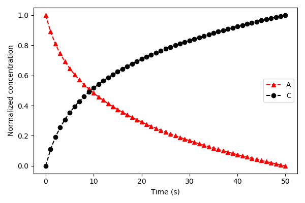
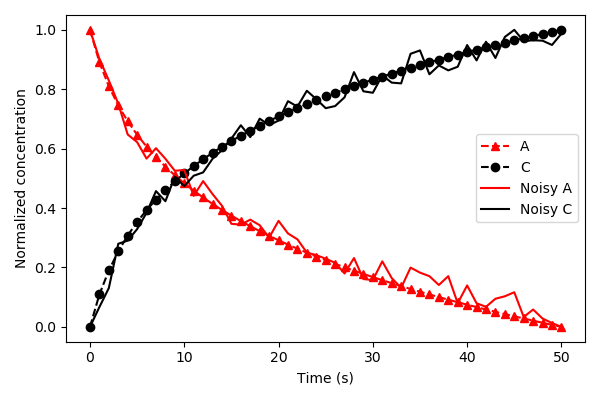
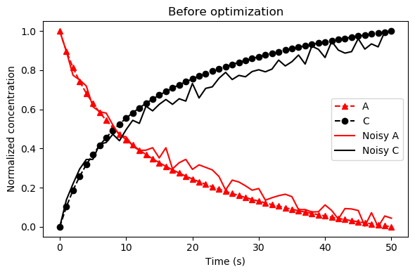
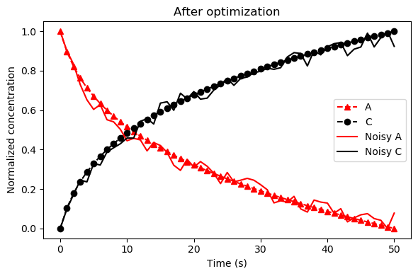

Example using PySB with ODE simulations
=======================================

.. code-block:: python

   import matplotlib.pyplot as plt
   import numpy as np

   from pysb.examples.robertson import model
   from pysb.simulator import ScipyOdeSimulator
   from simplepso.logging import get_logger
   from simplepso.pso import PSO

For this example, we are going to train the model to some made up data.
Please refer to a PySB tutorial if you are new to PySB. This tutorial assumes
you have knowledge of PySB.

.. code-block:: python

    # setup model and simulator
    t = np.linspace(0, 50, 51)
    # observables of the model to train
    obs_names = ['A_total', 'C_total']

    # create pysb simulator instance
    solver = ScipyOdeSimulator(
        model,
        t,
        integrator='lsoda',
        integrator_options={'rtol': 1e-8, 'atol': 1e-8}
    )

.. code-block:: python

    # Defining a helper functions to use
    def normalize(trajectories):
        """Rescale a matrix of model trajectories to 0-1"""
        ymin = trajectories.min(0)
        ymax = trajectories.max(0)
        return (trajectories - ymin) / (ymax - ymin)

.. code-block:: python

    traj = solver.run()
    ysim_array = traj.dataframe[obs_names].values
    # normalize the values from 0-1 (see function definition below)
    ysim_norm = normalize(ysim_array)

    plt.figure(figsize=(6, 4))
    if title is not None:
        plt.title(title)
    plt.plot(t, ysim_norm[:, 0], '^r', linestyle='--', label='A')
    plt.plot(t, ysim_norm[:, 1], 'ok', linestyle='--', label='C')
    plt.ylabel('Normalized concentration')
    plt.xlabel('Time (s)')

For training purposes, we will use the trajectories above and add some random
noise.

.. code-block:: python

    noise = 0.05
    noisy_data_A = norm_data[:, 0] + np.random.uniform(-1 * noise, noise, len(t))
    norm_noisy_data_A = normalize(noisy_data_A)

    noisy_data_C = norm_data[:, 1] + np.random.uniform(-noise, noise, len(t))
    norm_noisy_data_C = normalize(noisy_data_C)

    ydata_norm = np.column_stack((norm_noisy_data_A, norm_noisy_data_C))

.. code-block:: python

    plt.figure(figsize=(6, 4))
    plt.plot(t, ysim_norm[:, 0], '^r', linestyle='--', label='A')
    plt.plot(t, ysim_norm[:, 1], 'ok', linestyle='--', label='C')
    plt.plot(t, norm_noisy_data_A, 'r-', label='Noisy A')
    plt.plot(t, norm_noisy_data_C, 'k-', label='Noisy C')
    plt.legend(loc=0)
    plt.ylabel('Normalized concentration')
    plt.xlabel('Time (s)')

Next, we define the cost function. The cost function should take a parameter
set as an argument and return a scalar value, where the ultimate goal is to
minimize this value. To efficiently sample across large parameter space, we
use log10 space for the parameters. This means before you
pass them back to the simulator, you must convert them to linear space.
We are also only optimizing the rate parameters from the model, not the
initial conditions, so we must create a mask to identify which parameters in
the model are rate versus initial conditions.
.. code-block:: python

    rate_params = model.parameters_rules()
    rate_mask = np.array([p in rate_params for p in model.parameters])
    param_values = np.array([p.value for p in model.parameters])
    log_original_values = np.log10(param_values[rate_mask])

Here we use the chi square metric to determine the distances between the
trajectory of the parameter sets and our training data.

.. code-block:: python

    def obj_function(params):
        # create copy of parameters
        params_tmp = np.copy(params)
        # convert back into regular base
        param_values[rate_mask] = 10 ** params_tmp
        traj = solver.run(param_values=param_values)
        ysim_array = traj.dataframe[obs_names].values
        ysim_norm = normalize(ysim_array)
        # chi^2 error
        err = np.sum((ydata_norm - ysim_norm) ** 2)
        # if there are nans, return a really large number
        if np.isnan(err):
            return 1000
        return err

.. code-block:: python

    # make up a random starting point
    start_position = log_original_values + \
                     np.random.uniform(-1, 1,
                                       size=len(log_original_values))

We can see that these are not ideal.

.. code-block:: python

    param_values[rate_mask] = 10 ** start_position
    traj = solver.run(param_values=param_values)
    ysim_array = traj.dataframe[obs_names].values
    ysim_norm = normalize(ysim_array)

    plt.figure(figsize=(6, 4))
    plt.plot(t, ysim_norm[:, 0], '^r', linestyle='--', label='A')
    plt.plot(t, ysim_norm[:, 1], 'ok', linestyle='--', label='C')
    plt.plot(t, norm_noisy_data_A, 'r-', label='Noisy A')
    plt.plot(t, norm_noisy_data_C, 'k-', label='Noisy C')
    plt.legend(loc=0)
    plt.ylabel('Normalized concentration')
    plt.xlabel('Time (s)')

Finally, we get to initialize and run the PSO class. The main options to
consider when running the algorithm are the `num_particles`, `num_iterations`,
`num_processors`. The `num_particles` should be a multiple of the `num_processors`.
You can set `num_iterations` as large as you'd like, but if you set it to a large
value, you should consider setting the `max_iter_no_improv` or `stop_threshold`
options.

.. code-block:: python

    # Here we initial the class
    # We must provide the cost function and a starting value
    optimizer = PSO(start=start_position, verbose=True, shrink_steps=False)

    # We also must set bounds of the parameter space, and the speed PSO will
    # travel (max speed in either direction)
    optimizer.set_bounds(parameter_range=4)
    optimizer.set_speed(speed_min=-.05, speed_max=.05)

    # Now we run the pso algorithm
    optimizer.run(num_particles=48, num_iterations=500, num_processors=12,
                  cost_function=obj_function, max_iter_no_improv=25)

Done! We can then use `optimizer.best.pos` to access the best fit parameters.

.. code-block:: python

    best_params = optimizer.best.pos
    param_values[rate_mask] = 10 ** best_params
    traj = solver.run(param_values=param_values)
    ysim_array = traj.dataframe[obs_names].values
    ysim_norm = normalize(ysim_array)

    plt.figure(figsize=(6, 4))
    plt.plot(t, ysim_norm[:, 0], '^r', linestyle='--', label='A')
    plt.plot(t, ysim_norm[:, 1], 'ok', linestyle='--', label='C')
    plt.plot(t, norm_noisy_data_A, 'r-', label='Noisy A')
    plt.plot(t, norm_noisy_data_C, 'k-', label='Noisy C')
    plt.legend(loc=0)
    plt.ylabel('Normalized concentration')
    plt.xlabel('Time (s)')

